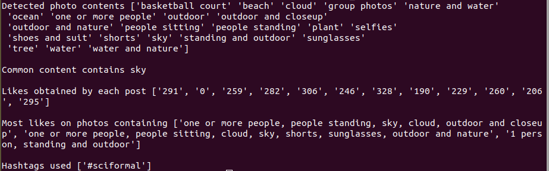

# Insta-Insight

## Getting Started
**Built with Python 3.6.7**  

Create a virtual enviorment, activate and install dependancies.
```
python3 -m virtualenv venv
source venv/bin/activate
pip install -r requirements.txt
```
For selenium, you need a chrome driver. The file `utils.py` assumes the executable file to be in the path `./chromedriver/chromedriver.exe`. You can install chromedriver for your respective operating system [here](https://chromedriver.storage.googleapis.com/index.html?path=2.45/).

To run the script,  
`python insight.py [username]`

A sample output can be seen below from runnning the script with a public account.  

